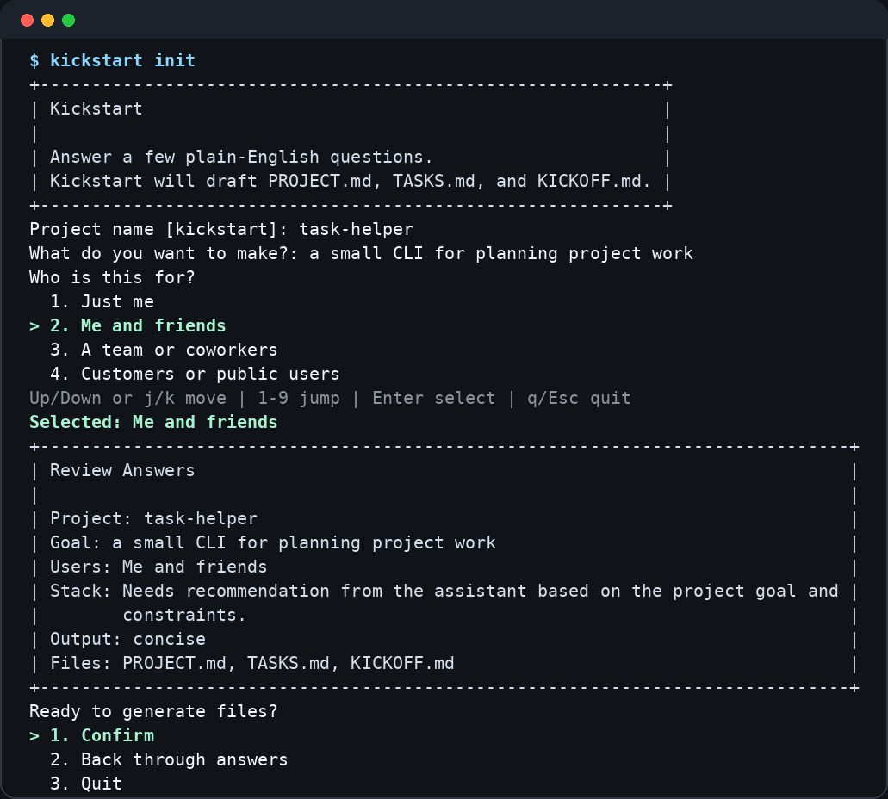

# Kickstart

Kickstart is a small Python CLI for turning a rough project idea into a practical kickoff packet.

It asks a short set of plain-English questions, then drafts:

- `PROJECT.md` for stable project context
- `TASKS.md` for the first execution checklist
- `KICKOFF.md` for the first structured assistant prompt

Kickstart is designed for local use at the start of a project, before the repo has enough shape for a detailed plan.



## Features

- guided interview for new projects or existing repositories
- keyboard-friendly terminal menus with arrow keys, `j`/`k`, number shortcuts, and `q`/Escape quit
- review step before any files are generated
- preview mode by default
- write mode that refuses accidental overwrites
- existing-repo snapshot with common files, branch, and dirty-state detection
- concise or detailed kickoff output
- no runtime third-party dependencies

## Requirements

- Python `3.11` or newer
- `git` for existing-repo inspection

Kickstart runs without network access and does not require a background service.

## Install

### Install Directly From GitHub

Use this if you want the `kickstart` command available on your `PATH` without cloning the repo manually:

```bash
python3 -m pip install --user git+https://github.com/betnbd/kickstart.git
```

If your Python user scripts directory is not on `PATH`, add it first:

```bash
python3 -m site --user-base
```

The command usually lives under:

```text
~/.local/bin
```

Verify the install:

```bash
kickstart --help
```

### Install With pipx

If you use `pipx` for isolated CLI tools:

```bash
pipx install git+https://github.com/betnbd/kickstart.git
kickstart --help
```

### Run From Source

Use this path if you want to inspect or modify the code:

```bash
git clone https://github.com/betnbd/kickstart.git
cd kickstart
python3 -m venv .venv
. .venv/bin/activate
python -m pip install -e .
kickstart --help
```

You can also run from a checkout without installing:

```bash
PYTHONPATH=src python3 -m kickstart init
```

## Quick Start

Preview generated files without writing anything:

```bash
kickstart init
```

Write the generated files to a directory:

```bash
kickstart init --write --output-dir ./example-output
```

Start from an existing repository:

```bash
kickstart init --project-type existing --repo-path /path/to/repo
```

By default, Kickstart refuses to overwrite existing generated files. In an interactive terminal, write conflicts show a menu where you can preview instead, overwrite, or quit.

Use `--force` only when replacing generated files is intentional:

```bash
kickstart init --write --force --output-dir ./example-output
```

## How It Works

The interview collects:

- project type
- output mode
- project name and goal
- target users
- likely stack or stack recommendation request
- constraints, definition of done, and risks
- quality preset
- concise or detailed kickoff style

For existing repositories, Kickstart also records a small snapshot:

- repository path
- common project files
- current Git branch
- whether the worktree has uncommitted changes

Before generation, the review panel lets you confirm, go back through answers, or quit without writing files.

## Prompt Model

Kickstart follows a compact prompt structure used across common AI-assistant guidance:

- task: what you want to make
- audience: who it is for
- context: constraints, risks, and current repo state
- success: what finished means
- output format: concise or detailed kickoff guidance

References:

- OpenAI: https://help.openai.com/en/articles/6654000-best-practices-for-prompt-en
- Microsoft Learn: https://learn.microsoft.com/en-us/azure/ai-services/openai/concepts/prompt-engineering
- Google Cloud: https://docs.cloud.google.com/vertex-ai/generative-ai/docs/learn/prompt-best-practices

## Safety and Privacy

Kickstart is a local CLI. It does not make network requests, collect telemetry, or execute generated files.

Existing-repo inspection runs read-only `git` commands through `subprocess.run()` without a shell. Write mode only writes `PROJECT.md`, `TASKS.md`, and `KICKOFF.md`.

Generated files may include paths, constraints, risks, and other context you type into the prompts. Review generated output before committing or publishing it.

See [SECURITY.md](SECURITY.md) for security reporting guidance.

## Development

Run the default validation commands from the repository root:

```bash
PYTHONPATH=src python3 -m unittest discover -s tests
python3 -m compileall -q src tests
```

Check editable install behavior:

```bash
python3 -m venv /tmp/kickstart-check
/tmp/kickstart-check/bin/python -m pip install -e .
/tmp/kickstart-check/bin/kickstart --help
rm -rf /tmp/kickstart-check
```

Before changing repository visibility or publishing a release, scan the current tree and reachable Git history for local paths, secrets, and private workflow files.

## Repository Layout

- `src/kickstart/cli.py` - command-line flow, prompts, repo inspection, and write handling
- `src/kickstart/brief.py` - generated file models and renderers
- `src/kickstart/ui.py` - small terminal rendering helpers
- `tests/` - unit tests for generation, CLI flow, and UI formatting
- `.github/workflows/ci.yml` - CI for supported Python versions

## License

MIT. See [LICENSE](LICENSE).
